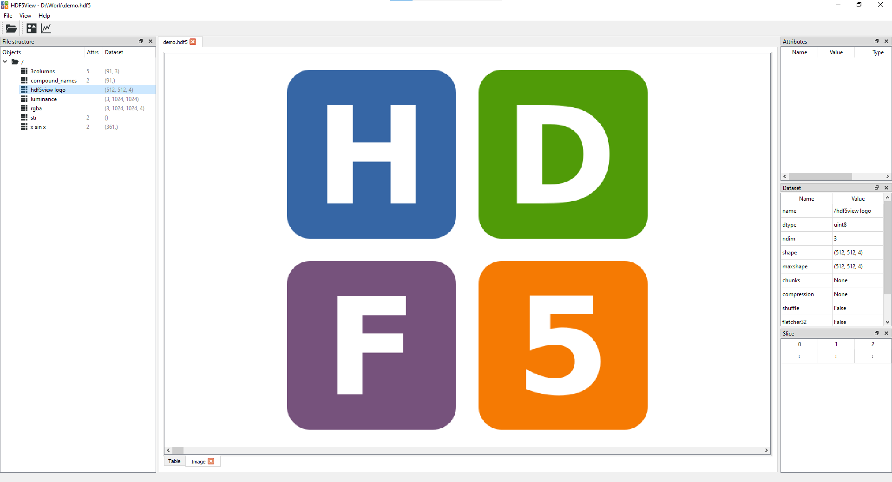
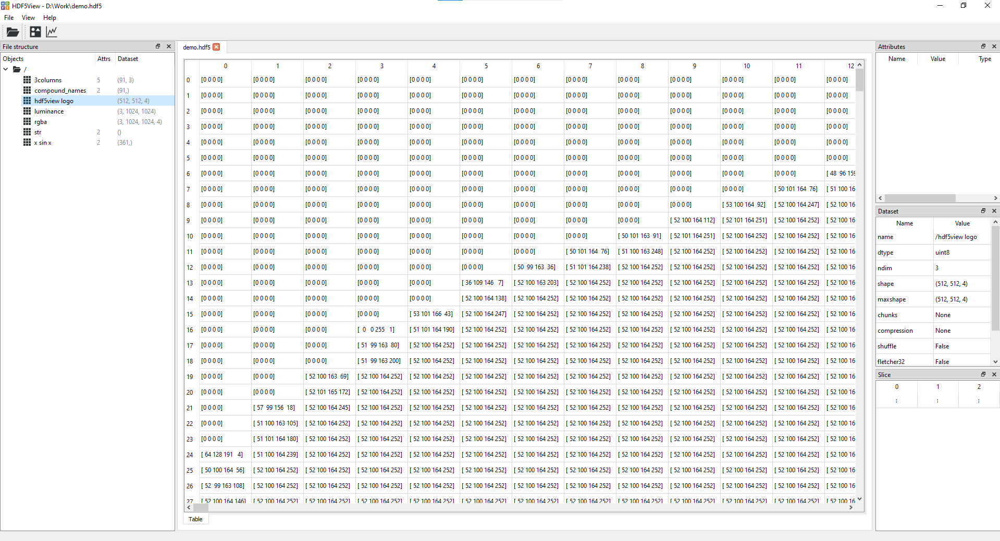

[](https://pypi.python.org/pypi/hdf5view/)
[](https://pypi.python.org/pypi/hdf5view/)

# **hdf5view**   

**Simple Qt/Python based viewer for HDF5 files.**

Features:
- Image tab(s) showing rgb(a) or grayscale images of a selected node:



<br>

- Plot tab(s) showing columns of data in a node:


   
<br>

- Table tab giving a view of the data in the dataset selected:



<br>

- File Structure table giving a tree view of the hdf5 file
- Attributes table showing any attributes assigned to a dataset
- Dataset table showing *e.g.* the shape, number of dimensions and data type of a dataset
- Slice table showing which slice of the data is currently displayed (can be set by the user)
- Export images/plots in a variety of formats (image files, data files, hdf5, matplotlib window)
- Datasets are loaded dynamically, so hopefully it should be able to handle HDF5 files of any size and structure.
- Warnings are given when selecting a dataset if loading it would consume more than 30% of the available memory. The user can the opt to abort or continue loading.

<br>

**Why use hdf5view?**

hdf5view is a simple Qt/Python based tool which aims to be easy to use and to allow you to get a view of your data with just a few clicks. If you need to check the structure of an HDF5 file, quickly see what data it contains or choose a dataset for futher analysis in another program, hdf5view may be for you. We don't aim to be able to create or edit HDF5 files and have only minimal possibilties for data analysis other than just viewing it. Other viewers for HDF5 files are available, including that from the [HDF5 Group](https://www.hdfgroup.org/), which also has capabilities for creating and editing HDF5 files. 

<br>

## **1. Installing**

hdf5view is designed to be platform independent.

#### **Qt API Bindings**

One of [pyqt5](https://www.riverbankcomputing.com/software/pyqt/), [pyside2](https://pyside.org), [pyqt6](https://www.riverbankcomputing.com/software/pyqt/) or [pyside6](https://pyside.org) is required in order to be able to run hdf5view. Please install one of these e.g. with pip:

```
pip install pyqt5
```

or on linux (Ubuntu/Debian), you can install a system package:

```
sudo apt install python3-pyqt5
```

[qtpy](https://github.com/spyder-ide/qtpy) is used as an abstraction layer for pyqt5/pyside2/pyqt6/pyside6. If you have any of these Qt API bindings installed, qtpy will take the first available one in the order shown in the previous sentence. hdf5view works with all of the bindings. If you have more than one of the bindings installed and want to specify which one should be used for hdf5view, you can do this by setting the `QT_API` environment variable before running hdf5view.

For example: if you have pyqt5 and pyside2 installed and you want hdf5view to use PySide2, on Windows PowerShell:

```
$env:QT_API = 'pyside2'
```

or on linux (Ubuntu/Debian)

```
export QT_API=pyside2
```

before running HDF5View

<br>

#### **Other Dependencies**

The other dependencies are [qtpy](https://github.com/spyder-ide/qtpy), [h5py](https://www.h5py.org/), [psutil](https://github.com/giampaolo/psutil) and [pyqtgraph](https://www.pyqtgraph.org/). Currently installed versions of these dependencies will not be overwritten by installing hdf5view. If these are not already present on your system, they will be installed during the installation of hdf5view. 

If you prefer to install them in advance, you can use pip:

```
pip install h5py, qtpy, psutil, pyqtgraph
```

or on linux to install system packages:

```
sudo apt install python3-h5py python3-pyqtgraph python3-psutil python3-qtpy
```

Note: [pyqtgraph](https://www.pyqtgraph.org/) 0.12 supports all of pyqt5, pyside2, pyqt6 or pyside6. Older versions of pyqtgraph may not support all of them.

<br>

#### **hdf5view**

To install the current release from PyPI system-wide on Windows:

```
pip install hdf5view
```

or on linux:

```
sudo pip3 install hdf5view
```

To install the current development version, download or clone the repo and install either system-wide on Windows:

```
cd hdf5view
pip install .
```

or on linux:

```
cd hdf5view
sudo pip3 install .
```

You could also use the flag -e with the pip command to install in editable mode, then you can pull changes from the repo and they are automatically available on your system.

To setup an isolated development environment using virtualenv:

```
python3 -m virtualenv -p python3 .
source bin/activate
pip install -e .
```

To uninstall hdf5view:

```
pip uninstall hdf5view
```

or:

```
sudo pip3 uninstall hdf5view
```

<br>

## **2. Running**

#### **Context menu**

A particularly useful way to use hdf5view is to add an entry to the context menu. This way, you can right click on an HDF5 file and select "Open with hdf5view" from the menu.

On Windows, to get "Open with hdf5view" on the right click context menu, we need to modify the registy. Run the registry editor (regedit) as an administrator, then add this command:

`C:\Program Files\PythonXXX\Scripts\hdf5view.exe -f "%1"`

to a new key "Open with hdf5view" in the registry under `HKEY_CLASSES_ROOT\*\shell`. Replace XXX with the number of your Python version *e.g.* 38 for Python38.

**Note:** enclosing %1 in quotes (as above) `"%1"` ensures that filenames including
spaces are passed correctly to hdf5view.

If you want to add the icon to the context menu as well, right click on the
"Open with hdf5view" key and select new String Value. Call it "Icon" and
then set the value to the path to the hdf5view icon e.g. `C:\Program Files\PythonXXX\Lib\site-packages\hdf5view\resources\images\hdf5view.ico`

<br>

#### **Command line**

In the terminal call:

```
hdf5view
```

to start the program, or

```
hdf5view -f <hdf5file>
```

to start the program and open the HDF5 file specified. HDF5 files can also be dropped onto the application window once opened.

<br>

#### **Desktop icon**

You can also create a desktop link to start the program for convenience. A Windows icon file hdf5view.ico is provided in the folder hdf5view/resources/images.

<br>

## **3. Usage**

#### **Basic**

The structure of the HDF5 file can be navigated using the tree view on the left hand side. The central panel displays a table of the data at the node selected. If the node has more than two dimensions, a 2D slice of the data is displayed in the table (a 3D slice is shown if the shape of the last dimension is 3 or 4: in this case we assume the data are rgb(a) images). On the right hand side you can see and modify the slice shown; and see details of the node and any associated attributes.

#### **Images**

- To display an image of a particular node, click the image icon on the toolbar at the top of the window. This will open an Image tab at the current node.
- You can have several Image tabs open at once.
- Image tabs remember the node and slice if you switch to a different tab and back.
- Switching to a different node results in the default rendering behaviour for the image.

The default image rendering is as follows: 
* Greyscale: if the node has two or more dimensions and the shape of the last dimension is greater than 4. The image is initially taken from the last two dimensions of the node. A scrollbar is provided, which currently can be used to scroll through the first dimension of the node. This is useful for viewing a stack of greyscale images. You can alternatively change the slice manually and the scrollbar will move accordingly.

* rgb or rgba: if the node has three or more dimensions and the shape of the last dimension is three or four. If the node has more than three dimensions, a scrollbar is provided, which can be used to scroll through the first dimension. This is useful for a stack of rgb or rgba images, for example.


#### **Plots**

**Plotting a single column of data against the index**

- Click the plot icon on the toolbar at the top of the window to open a Plot tab at the current node. This will generate a default plot for the node selected showing the data plotted against the index (similar to row number).
- You can have several Plot tabs open at once.
- Plot tabs remember the node and slice if you switch to a different tab and back.
- Switching to a different node results in the default rendering behaviour for the plot.

The defaults for various node shapes are as follows:
* 1D node: all the data are plotted against the index, Slice: `:`
* 1D node with compound names: the data in the first column are plotted, Slice `:, 0`.
* 2D node: all the rows of the first column are plotted, Slice `:, 0`
* \>2D node where the last dimension has shape 3 or 4: here we assume that the data are rgb(a) images and plot as default all the rows of the -3rd axis in the first column of the -2nd axis and the first column of the -1st axis (red channel), last 3 axes of Slice `:, 0, 0`.
* other \>2D nodes: we plot as default all the rows of the -2nd axis in the first column of the -1st axis, last 2 axes of Slice `:, 0`.

<br>

**Changing the plot**

- Select the Slice accordingly *e.g.* to plot all the rows of the third column of data in a 2D dataset, change the Slice from the default `:, 0` to `:, 2`.
- You can also slice in the first dimension *e.g.* to plot the first 10 rows of the third column of data in a 2D dataset, set the Slice to `:10, 2`.

**Plotting two columns of data against each other**

The Slice table can be used to select two columns to be plotted against each other instead of plotting a single column of data against the index. The axis labels in the plot are updated accordingly. As an example, to plot all the rows of the first two columns of data in a 2D node against each other, set the slice to `:, :2`.

<br>

## **4. Testing**

Currently there are no unit tests for this package. The gui has been tested with qtpy=2.2.0, pyqtgraph=0.12.4 and h5py=3.7.0 in combination with pyqt5=5.15.7, pyside2=5.15.2.1, pyqt6=6.3.1 and pyside6=6.3.2, and it works with all of the Qt API bindings.

<br>

## **5. Issues**

If there are any issues, please feel free to use the [issues mechanism on github](https://github.com/marts/hdf5view/issues) to get in touch.

<br>

## TODO:

* Implement dynamic loading for files larger than the available memory
* Add documentation
* Possibly add 3D rendering, likely based on pyqtgraph
